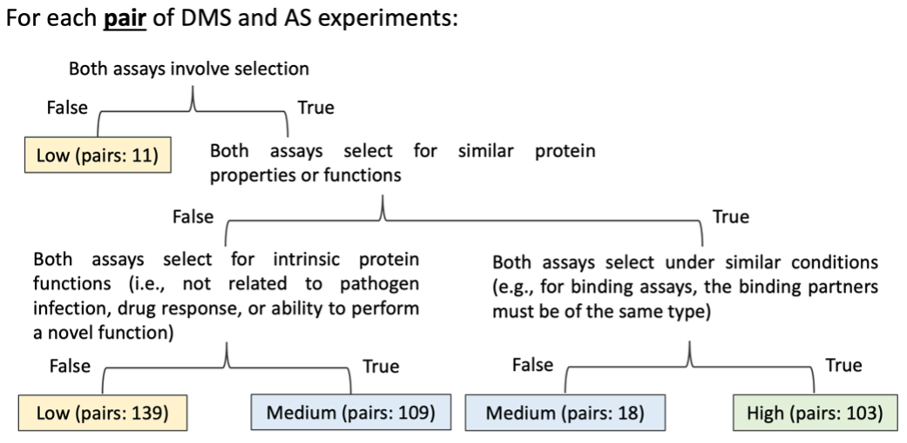

# Integrate low-throughput mutagenesis data to deep mutational scanning based variant impact predictors

### Abstract

We extended a linear regression-based predictor to explore whether incorporating data from alanine scanning (AS), a widely-used low-throughput mutagenesis method, would improve prediction results.

Code stored here are used for data processing, variant impact predictor modelling and result analysis.

### Setup & usage

1. Create a virtual environment with Python 3.10.6.
2. Install required Jupyter Notebook and other pacakges according to `requirements.txt`
3. Follow the code and instructions in the notebooks (`./jupyter_code/`).

### Notebook content
* `P0_Data_processing`: 
	* Download DMS data from [MaveDB](https://www.mavedb.org/)
	* Normalize DMS and alanine scanning data
	* Add other protein features
* `P1_Statistics_of_curated_data`: Overview of collected mutagenesis data
* `P2_Linear_integration_of_AS_data`: Building and evaluating linear variant impact predictors using alanine scanning data as an extra feature
* `P3_Alternative_modelling_options`: Building and evaluating variant impact predictors in alternative ways

### Data content
* `data_compatibility_221024.csv` is the assay compatibility data for each pair of DMS and alanine scanning dataset used in this analysis. The class of assay compatibility is manually curated according to the following decision tree:

* Folder `low-throughput_data` contains alanine scanning data collected from previously published papers.
* Folder `demask` contains protein features downloaded from [DeMaSk oline toolkit](https://demask.princeton.edu/query/).
* Folder `envision` contains protein features downloaded from [Envision oline toolkit](https://envision.gs.washington.edu/shiny/envision_new/).
* Folder `reference` contains protein sequence in FASTA format downloaded from [UniProt](https://www.uniprot.org/).